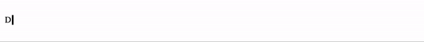
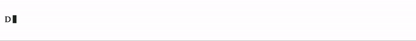
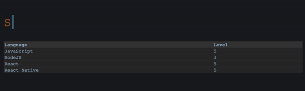

A simple typing animation in React.

[](https://www.npmjs.com/package/typewriting-react) [](https://github.com/julekgwa/typewriting-react) [](https://unpkg.com/typewriting-react/dist/index.js)  


## Installation

```bash
$ npm install typewriting-react
```

or

```bash
$ yarn add typewriting-react
```

## Usage

```Javascript
import React from 'react';

import { Typewriter } from 'typewriting-react';

function App() {
  return (
    <div className="App">
      <Typewriter words={['Developer', 'UX Designer']} />
    </div>
  );
}

export default App;
```



## API

| Prop           | Type             | Default   | Description                                                                           |   |
|----------------|------------------|-----------|---------------------------------------------------------------------------------------|---|
| words      | array             | Required     | Array of strings to be animated |   |
| loop        | bool             | true  |  The animation loop                                       |   |
| typingSpeed       | number             | 50  | Typing speed in milliseconds                                                    |   |
| erasingSpeed | number             | 100     | Erasing speed in milliseconds                                   |   |
| nextWordDelay   | number           | 2000     | Time delay before erasing                                       |   |
| onWordFinishTyping       | func             | () => {}     |  Called after typing each word, with index of the current word                  |   |
| onFinished           | func           | () => {}      | Called after typing all words in the array                            |   |
| cursorStyle  | object             | {}     | Cursor style                               |   |
| style           | object           | {}  | Text style                         |   |
| className       | string             |      |  Text css class name         |   |
| cursorClassName           | string           |   | Cursor css class name                                   |   |

## Styling cursor using css

simple css cursor style

```css
.cursor {
  background: lime;
  line-height: 17px;
  margin-left: 3px;
  animation: blink 0.8s infinite;
  width: 7px;
  height: 15px;
  display: inline-block;
}

@keyframes blink {
  0% {background: #222}
  50% {background: lime}
  100% {background: #222}
}
```

```Javascript
import React from 'react';

import { Typewriter } from 'typewriting-react';

// import css file

import './cursor.css';

function App() {
  return (
    <div className="App">
      <Typewriter cursorClassName='cursor' words={['Developer', 'UX Designer']} />
    </div>
  );
}

export default App;
```



## Advanced usage

```Javascript
import React, {useState}> from 'react';

import { Typewriter } from 'typewriting-react';

import Table from './Table';

function App() {
  const [headers, setHeaders] = useState([]);
  const [index, setIndex] = useState(0);
  const [tableData] = useState([...]);

  return (
    <>
      <div className='container'>
        <Typewriter
          className='sql-statement'
          cursorClassName='cursor'
          loop={true}
          onWordFinishTyping={(idx) => {
            setIndex(idx);
            setHeaders(createHeaders(tableData[idx]));
          }}
          words={words}
        />
      </div>
      <Table headers={headers} data={tableData[index]} />
    </>
  );
});
```



## License

MIT
